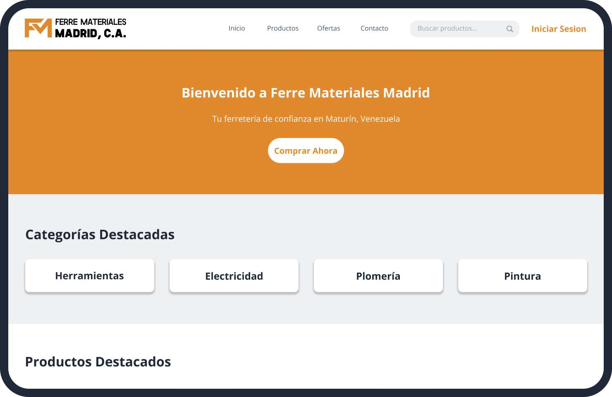

    

# Web Oficial de FerreMateriales Madrid

FerreMateriales Madrid es una empresa de ferretería dedicada a la venta de materiales de construcción, herramientas y artículos de bricolaje. Encuentra productos, ofertas especiales y gestiona tu carrito de compras directamente desde nuestra plataforma.

## 🚀 Tech Stack 

  
[![Next.js][nextjs-badge]][nextjs-url]
[![React][react-badge]][react-url]
[![TailwindCSS][tailwindcss-badge]][tailwindcss-url]
[![TypeScript][typescript-badge]][typescript-url]

## 📸 Capturas de Pantalla

    
    <em>Vista principal del catálogo</em>

## 🌟 Características Principales
- Catálogo de productos con búsqueda
- Carrito de compras interactivo
- Sistema de autenticación de usuarios
- Panel de administración para empleados
- Sección de subida de CVs

<!-- Badges -->

[react-badge]: https://img.shields.io/badge/React-087EA4?style=for-the-badge&logo=react&logoColor=white
[nextjs-badge]: https://img.shields.io/badge/Next.js-323336?style=for-the-badge&logo=nextjs&logoColor=white
[tailwindcss-badge]: https://img.shields.io/badge/TailwindCSS-38B2AC?style=for-the-badge&logo=tailwind-css&logoColor=white
[typescript-badge]: https://img.shields.io/badge/TypeScript-007ACC?style=for-the-badge&logo=typescript&logoColor=white

<!-- URLs -->

[react-url]: https://es.react.dev/
[nextjs-url]: https://nextjs.org/
[tailwindcss-url]: https://tailwindcss.com/
[typescript-url]: https://www.typescriptlang.org/
[FerreMaterialesMadrid-url]: https://github.com/Andru0Gx/FerreMaterialesMadrid-Web-Oficial
